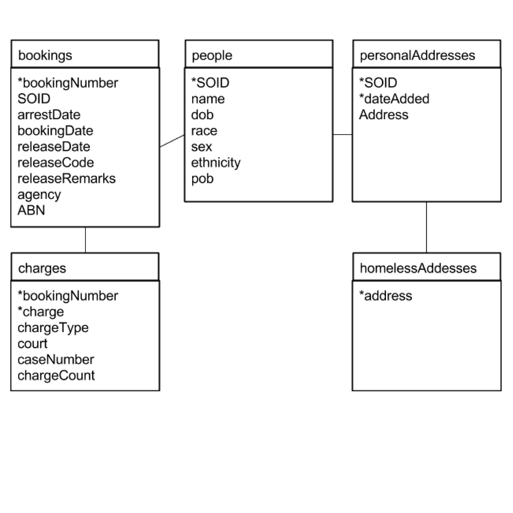

```{r setup, include=FALSE}
knitr::opts_chunk$set(echo = TRUE, eval=FALSE, cache=TRUE)
```

```{r, echo=FALSE}
setwd("~/Documents/courses/newCollege/current/databases/assignments/a4/")
```

1.  **Jail database people.**

    a. **Show how to uniquely identify a person in the jail database.**
        
        We can uniquely identify a person by the `SOID` column of `bookingsB`. To confirm this, we can do the following queries: 
        

            CREATE TEMPORARY TABLE soidVSname AS
              SELECT DISTINCT a.name AS name, a.DOB as dob, b.SOID AS soid
                FROM bookingsA as a
                  JOIN bookingsB as B
                    ON a.bookingNumber = b.bookingNumber;
                    
            SELECT soid, COUNT(*) AS count FROM soidVSname
              GROUP BY soid
              ORDER BY count DESC
              LIMIT 10;
        
        Which returns with something strange:
        
            220366|12
            261576|10
            123625|9
            132521|9
            192905|9
            226660|9
            301663|9
            369890|9
            375904|9
            174224|8
        
        But, when one investigates SOID 220366, one finds that every person associated with this SOID fits a relatively similar description: They're all black male (with ethnicity n) named Archie Martin and born in the early 1950s. The problem is that the birthdate entries are not exactly the same in these records. But they're close enough to suggest that these are all the same person.
        
        Hence, we have a deeper problem. Do we assume that the SOID's are meant to be unique per person and that there was an error in data-entry (which sort of makes any conclusions somewhat meaningless because our data is admittedly seriously flawed), or do we press on under the assumption that about 7 different people with nearly identical descriptions and identical names just happened to get the same random SOID? It seems as though we have no choice but to assume that our data queality is extremely low and use our own subjective enterpretations accross the board. So, since I can't really do any worse here, I'm going to assume that the SOID's are the unique identifiers. (I would normally check to see if people with the same unpopular name have many SOIDs, but given that Archie Martin got 28 different bookings, each with the same SOID and the assessed data quality, I think we're good to move on.)


    a. **Does one person in the jail database ever have more than one race?**
    
            SELECT SOID, COUNT(DISTINCT race) AS count
              FROM bookingsB
              GROUP BY SOID
              ORDER BY count DESC
              LIMIT 10;
            323321|5
            454663|5
            509125|5
            317601|4
            341684|4
            464362|4
            499582|4
            509355|4
            549859|4
            566879|4
            
        So, naturally we check out 323321 and find:
        
            SELECT * FROM bookingsB WHERE SOID = 323321;
            JAMES,OSWALD|98010365|TPD|41725|W|M|N|10/18/1957|ON SCENE |DRIVING UNDER THE INFLUENCE|14A |0252728X|5205 BLVD N|TAMPA|YY|02/23/1998|SURETY BOND|323321
            JAMES,OSWALD|97007153|HCSO|4170|W|M|N|10/18/1957|PROBABLE CAUSE |BATTERY (DOMESTIC VIOLENCE)|41F |9703293|8023 HIDDEN RIVER DR|TEMPLE TERRACE|YY|02/10/1997|SURETY BOND|323321
            JAMES,OSWALD|96020414|TPD|37240|W|M|N|10/18/1957|ON SCENE |DRIVING UNDER THE INFLUENCE|14A |0248460X|2083 HIDDEN RIVER DR|TAMPA|YY|04/27/1996|SURETY BOND|323321
            JAMES,OSWALD|95050145|HCSO|3481|W|M|N|10/18/1957|PROBABLE CAUSE |BATTERY (DOMESTIC VIOLENCE)|41F |9523926|6908 RIVER RUN DR #201|TAMPA|IN|12/04/1995|SURETY BOND|323321
            JAMES,OSWALD|7039161|TPD|45555|U|M|N|10/18/1957|PROBABLE CAUSE |DRIVING UNDER THE INFLUENCE THIRD OR SUB|31|07-CF-012518|5903 TROUT RIVER DR APT 101|TAMPA|BL|06/18/2007|SURETY BOND|323321
            JAMES,OSWALD|3022275|HCSO|3934|W|M|N|10/18/1957|PROBABLE CAUSE |TAMPERING WITH A WITNESS|31O |03-CF-006348|6904 RIVER RUN DR 101|TAMPA|II|07/01/2003|PROBATION|323321
            JAMES,OSWALD|3007137|HCSO|2156|W|M|H|10/18/1957|COURT ORDER |DRIVING UNDER THE INFLUENCE|14A |471997W|904 RIVERTREE DR #101|TAMPA|BL|02/12/2003|TIME SERVED|323321
            JAMES,OSWALD|3003451|TPD|44851|A|M|N|10/18/1957|ON SCENE |DRIVING UNDER THE INFLUENCE OVER 0.20|14A |0471997W|2023 DAVIS ST|TAMPA|BL|01/18/2003|SURETY BOND|323321
            JAMES,OSWALD|1064372|TPD|43911|W|M|H|10/18/1957|PROBABLE CAUSE |SOLICITING ANOTHER TO COMMIT PROSTITUTION|41A |01-CM-040960|3526 PAUL AV W|TAMPA|YY|11/27/2001|SURETY BOND|323321
            JAMES,OSWALD|1038462|TPD|45160|I|M|N|10/18/1957|PROBABLE CAUSE |BATTERY (DOMESTIC VIOLENCE)|41F |01-CM-027046|5111 CLARICE CT S D|TAMPA|YY|09/20/2001|COURT ORDER|323321
            JAMES,OSWALD|1028867|TPD|43119|W|M|N|10/18/1957|PROBABLE CAUSE |BATTERY (DOMESTIC VIOLENCE)|41F |01-CM-020162|5111 CLARICE CT S|TAMPA|YY|05/27/2001|SURETY BOND|323321
            JAMES,OSWALD|10044993|HCSO|3948|B|M|N|10/18/1957|COURT ORDER |DRIVING W/LICENSE CANC. SUSP. OR REVOKED|14|0007661GKB|4207 LAUREL ST W|TAMPA|BL|10/10/2010|TIME SERVED|323321

        So, the data is flawed. We probably can't trust much from this data at all. I wouldn't be surprised to find that there were flaws in the sex as well. Which means, any information we get on the different charge types would have to use some natural language proccessing techniques to account for typoes and other such differences in expression.
        
        But to answer the question, yes. It seems that quote a few people have multiple races in this database.

1.  **Normalize the jail database:**
    a.  **Draw an ER diagram with what you think are important entities. You can using the Drawing tool of Google Docs, starting with the ER Diagram Pieces doc.**
    
        An image of my plan going into this is included on the next page. The asterisks denote primary keys. 
        Note that the actual result does not have an addresses table. The reasoning is explained in part c when I try to insert the data and I realize that data quality issues remove any possible benefits of making the table.
        
        Also note that even though I do not have addresses in their own table, this database is still technically in 3rd normal form (as long as one considers typos as different values - something I will be doing for the sake of my sanity).
        
        On a side note, it's very difficult to discern what the relationships are supposed to be between variables due to the data quality, but I suspect, that if the data-entry portal had data validation, we would see a different structure. We would probalby then want to have a separate `cases` table, and we'd probably actually end up with an addresses table as well.
        
        

    a.  **Make a new database, jail_norm_niskin.db (readable by me), and create the tables for a jail db in 3rd normal form. Use all appropriate integrity constraints.**
        
        So first we copy jail.db into a new file called jail_normalized_niskin.db. Then we enter that new database to create the tables and such. To create the bookings table,
        
            CREATE TABLE people(
              SOID INTEGER PRIMARY KEY,
              name TEXT NOT NULL,
              dob TEXT,
              race TEXT,
              sex TEXT,
              ethnicity TEXT,
              pob TEXT
            );
            
            CREATE TABLE personalAddresses(
              SOID INTEGER,
              dateAdded TEXT,
              address TEXT,
              PRIMARY KEY (SOID, dateAdded),
              FOREIGN KEY (SOID) REFERENCES people(SOID)
            );
            
            CREATE TABLE bookings(
              bookingNumber INTEGER PRIMARY KEY,
              SOID INTEGER,
              arrestDate TEXT,
              bookingDate TEXT,
              releaseDate TEXT,
              releaseCode TEXT,
              releaseRemarks TEXT,
              agency TEXT,
              ABN TEXT,
              FOREIGN KEY (SOID) REFERENCES people(SOID)
            );
            
            In reality, each case should be it's own table, but since the case numbers are pretty flawed, I think we can leave it like this.
            CREATE TABLE charges(
              bookingNumber INTEGER,
              charge TEXT,
              chargeType TEXT,
              court TEXT,
              caseNumber TEXT,
              chargeCount INTEGER NOT NULL,
              PRIMARY KEY (bookingNumber, charge, chargeType, court, caseNumber),
              FOREIGN KEY (bookingNumber) REFERENCES bookings(bookingNumber)
            );
              

    a.  **Populate the new db. Show your work. Here’s how to work with two db’s in one sqlite3 session: **
    
        i. **Open jail.db.**
        i. **Attach your new db, giving it a schema name of jailnew.**
        i. **Now you can use table foo in the new db, as jailnew.foo.**
        
        So we do that.
        
            CREATE TEMPORARY TABLE pdb AS
              SELECT DISTINCT SOID,
                              name,
                              DOB,
                              race,
                              sex,
                              e AS ethnicity,
                              POB
                FROM bookingsB AS a
                WHERE race = (SELECT b.race FROM bookingsB AS b 
                                WHERE b.SOID = SOID LIMIT 1)
                  AND ethnicity = (SELECT b.e FROM bookingsB AS b
                                WHERE b.SOID = SOID LIMIT 1)
                  AND DOB = (SELECT b.DOB FROM bookingsB AS b
                                WHERE b.SOID = SOID LIMIT 1)
                  AND POB = (SELECT b.POB FROM bookingsB AS b
                                WHERE b.SOID = SOID LIMIT 1);
            
            INSERT INTO jnew.people
                (SOID, name, dob, race, sex, ethnicity, pob)
                SELECT * FROM pdb;
            
            CREATE TEMPORARY TABLE bdb AS
              SELECT DISTINCT b.bookingNumber,
                              b.SOID,
                              a.arrestDate,
                              a.bookingDate,
                              b.releaseDate,
                              b.releaseCode,
                              a.releaseRemarks,
                              b.agency,
                              b.ABN,
                              b.city
                FROM bookingsB AS b
                  JOIN bookingsA AS a
                    ON a.bookingNumber = b.bookingNumber;
        At this point I noticed that I had left off the "city" column of bookings. So let's add it:
        
            ALTER TABLE jnew.bookings ADD COLUMN city TEXT;
            
            INSERT INTO jnew.bookings
              (bookingNumber, SOID, arrestDate,
                bookingDate, releaseDate, releaseCode,
                releaseRemarks, agency, ABN, city)
              SELECT * FROM bdb;
            
            ALTER TABLE jnew.charges ADD COLUMN caseNumber TEXT;
            
            CREATE TEMPORARY TABLE cdb AS
              SELECT bookingNumber,
                     charge,
                     chargeType,
                     court,
                     caseNumber,
                     COUNT(*) AS chargeCount
                FROM (SELECT bookingNumber, charge, chargeType, court, caseNumber
                        FROM bookingsB
                      UNION ALL
                        SELECT bookingNumber, charge, chargeType, court, caseNumber
                          FROM booking_addl_charge) AS a
              GROUP BY a.bookingNumber, a.charge, a.chargeType, a.court, a.caseNumber;
            
            INSERT INTO jnew.charges (bookingNumber, charge, chargeType, court, caseNumber, chargeCount)
              SELECT * FROM cdb;
            
            CREATE TEMPORARY TABLE adb1 AS
              SELECT MIN(arrestDate, bookingDate, b.releaseDate) AS dateAdded,
                      bookings.SOID,
                      address
                FROM jnew.bookings AS bookings
                  JOIN bookingsB AS b
                    ON bookings.bookingNumber = b.bookingNumber;
  
        Just picking a random SOID to check out (just to see the state of affairs, and after some convincing by my teammate), I noticed that the addressses and date values were so inconsistent that if I were to implement this table, lookups would be significantly harder, and the number of rows in the addresses table would be so close to the number of rows in the bookings table as to make any benefit negligible if existant. So I decided to add the address column to the bookings table.
        
        The same reasoning applies to the caseNumber field (which should be it's own table, ideally). Below is an example of what the first 10 rows of the addresses table would look like for just the person with SOID 308163.
        
            01/19/2000|308163|7800 NEBRASKA AV N
            07/29/1997|308163|
            10/03/1996|308163|3534 NEBRASKA AV N
            11/02/1995|308163|7800 NEBRASKA AV N APT 8
            05/21/2004|308163|7800 NEBRASKA AV N 8
            02/06/2004|308163|GENRL DERLY
            10/07/2003|308163|8219 12TH ST N B
            06/25/2002|308163|8219 12TH ST N
            05/13/2002|308163|8219 12TH ST N APT B
            12/01/2001|308163|8219 NORFOLK

        So, instead I'll just be adding it to the bookings table.
            
            ALTER TABLE bookings ADD COLUMN address TEXT;
            
            UPDATE jnew.bookings
              SET address = (SELECT address FROM bookingsB AS b
                              WHERE b.bookingNumber = bookingNumber);
            
1.  **Put fanfiction.stories into 2nd normal form (which implies 1st normal form). To keep url as primary key you’ll need to create a new table. starringchars isn’t the only problem. You’ll probably want to read the Postgres docs on string functions. You can use psycopg2 if you want.**

    So I started out trying to do this problem using mainly commandline tools like `sed`, but my partner had a thing or two to say about that (and rightfully so). So instead we opted for psycopg2.
    
    For this, the code is in either of our folders, and the database is called `fanfiction_price_niskin`.
    His file is located at `/usr/share/databases/lprice/Fanfiction/populate_fanfiction.py`.
    My file is located at `/usr/share/databases/aniskin/assignment4/populate_fanfiction.py`.
    
1.  **Seven Databases, Chapter 2, Day 1 homework.**
    a.  **Find problem 3**
    
        3\. **In the addresses `FOREIGN KEY`, find in the docs what `MATCH FULL` means.**
    
        `MATCH FULL` is a flag of sorts that you can add to your table foreign keys. It will not allow any foreign keys to be null unless all the foreign keys in that row are null. But it seems to me that if you're using foreign keys at all, you probably want them to be `NOT NULL`, so it might be best to just use that.
        
    b.  **Do problems 1, 3.**
    
        1\.  **Select all the tables we created (and only those) from `pg_class`.**
        
            SELECT * FROM pg_class
              WHERE relname IN ('cities', 'countries', ...);
        
        3\. **Alter the `venues` table to contain a boolean column called `active`, with the default value of `TRUE`.**
        
            ALTER TABLE venues ADD COLUMN
                "active" BOOLEAN
                DEFAULT TRUE;
                
1.  **Seven Databases, Section 2.3, Day 2.**
    a.  **Read these subsections and follow along: Aggregate Functions, Group By, Stored Procedures (import /usr/share/databases/SevenDatabases/code/postgres/add_event.sql), Viewing The World (optional), and I’ll Meet You at the Crosstab.**
    a.  **In Day 2 WrapUp, do Do problem 2.**
    
            SELECT * FROM crosstab(
              'SELECT extract(year from starts) as year,
                      extract(month from starts) as month,
                      count(*)
                FROM events
                GROUP BY year, month',
              'SELECT * FROM generate_series(1, 12)'
            ) AS (
              year int,
              jan int, feb int, mar int, apr int, may int, jun int,
              jul int, aug int, sep int, oct int, nov int, dec int
            ) ORDER BY YEAR;