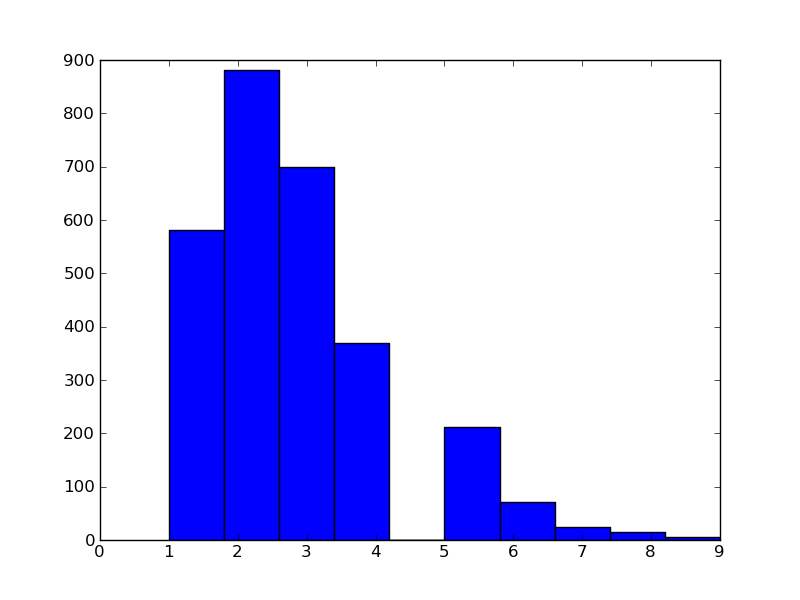

```{r setup, include=FALSE}
knitr::opts_chunk$set(echo = TRUE, eval=FALSE, cache=TRUE)
```

```{r, echo=FALSE}
setwd("~/Documents/courses/newCollege/current/databases/assignments/a4/")
```

1.  **Seven Databases, Section 2.4, Day 3, Do problems 1 and 2. For problem 2, get two or more user comments from each student in the class.**

    1.  **Create a stored procedure where you can input a movie title or actor’s name you like, and it will return the top five suggestions based on either movies the actor has starred in or films with similar genres.**


        So, this is not the way I would do this normally, but in the interest of time, I'll do it this way. Normally, I would create one function that takes an actor's id and spits out the suggestions, one that takes a movie's id and spits out the suggestions. Then I'd write one function that takes a string and uses monophones followed by trigrams to attempt to identify an actor's name (or movie's title). Then piece them together. But due to the fact that many movies and actors may sound alike, I'll just assume that the user will not have any typos. I will also be further assuming a preference toward movie titles. In other words, if one is searching for "John Malkovich", and the movie "Being John Malkovich" were actually named simply, "John Malkovich", my function would assume you're talking about the movie, not necessarily the actor.
```sql
CREATE OR REPLACE FUNCTION search_by_name_or_title( searchStr text )
  RETURNS TABLE(title TEXT) AS $$
  DECLARE
    is_movie boolean := (SELECT lower(searchStr) IN 
      (SELECT lower(x.title) FROM movies x));
  BEGIN
    IF is_movie THEN
      RETURN QUERY SELECT x.title FROM movies x
        ORDER BY cube_distance(genre, (SELECT y.genre FROM movies y
          WHERE lower(y.title) = lower(searchStr)))
        LIMIT 5;
    END IF; 
    RETURN QUERY SELECT x.title FROM movies x
      WHERE x.movie_id IN (SELECT y.movie_id FROM movies_actors y
        WHERE y.actor_id = (SELECT z.actor_id FROM actors z
          WHERE lower(z.name) = lower(searchStr)))
        LIMIT 5;
  END;
$$ LANGUAGE plpgsql;
```
        Pardon the indentation. It's not allowing me to indent properly.

    2.  **Expand the movies database to track user comments and extract keywords (minus English stopwords). Cross-reference these keywords with actors’ last names, and try to find the most talked about actors.**
```sql
CREATE TABLE movie_comments (
  comment_id SERIAL PRIMARY KEY,
  movie_id INTEGER REFERENCES movies(movie_id),
  comment_date DATE,
  comment TEXT);
CREATE INDEX movie_comments_id ON movie_comments (comment_id);
CREATE INDEX movie_comments_id ON movie_comments (movie_id);
CREATE INDEX movie_comments_id ON movie_comments (to_tsvector(comment));
CREATE VIEW most_commented_actors AS
  SELECT x.name, COUNT(*) num_mentions
    FROM actors x JOIN movie_comments mc
      ON to_tsvector(mc.comment) @@ plainto_tsquery(x.name)
    GROUP BY x.name
    ORDER BY num_mentions DESC;
```

2.  **Discuss whether hubway.trips is normalized.**

    Due to the fact that (in theory), the duration should be end_date(time) - start_date(time), this table is not in $3^\text{rd}$ normal form. There are no reduntant pieces of data, though, so it is $2^\text{nd}$ normal form. 
    Even so, this is probably a less-than-optimal solution as a design. I would imagine that it would be more beneficial to have a separate `users` table with columns, ID, ZIP, gender (if you want it), etc. Then you could just have a user_ID foreign key column in the `trips` table (set to null if the user isn't registered). You could then get rid of the registered column as it would be redundant (and hence break normality, if that's important to you).

3.  **Finish my solution to problem 2d in Assignment 2 (which I wrote in the assignment doc).**

    a.  **Using the temporary tables in the solution, write sql to make a table with columns charge, homeless arrest rate, non-homeless arrest rate, difference. Arrest rate is number of arrests for the charge divided by total arrests. Difference is the difference between rates, homeless vs. not.**
```sql
CREATE TEMPORARY TABLE total_homeless_counts AS
  SELECT SUM(ct) AS ct FROM homeless_charge_count
    WHERE homeless = 1;
CREATE TEMPORARY TABLE total_nonhomeless_counts AS
  SELECT SUM(ct) AS ct FROM homeless_charge_count
    WHERE homeless = 0;
CREATE TEMPORARY TABLE total_charge_counts AS
  SELECT h.ct AS h_ct, n.ct AS n_ct
    FROM total_homeless_counts AS h JOIN total_nonhomeless_counts AS n;
CREATE TEMPORARY TABLE total_charge_counts AS
  (SELECT SUM(x.ct) AS ct FROM homeless_charge_count AS x
    WHERE homeless = 0) AS h_ct,
  (SELECT SUM(x.ct) AS ct FROM homeless_charge_count AS x
    WHERE homeless = 1) AS n_ct;
CREATE TEMPORARY TABLE homeless_ct AS
  SELECT charge, ct FROM homeless_charge_count
    WHERE homeless = 1;
CREATE TEMPORARY TABLE nonhomeless_ct AS
  SELECT charge, ct FROM homeless_charge_count
    WHERE homeless = 0;
CREATE TEMPORARY TABLE relative_arrest_rates_tmp AS
  SELECT h.charge AS charge,
        CAST(h.ct AS REAL) / t.h_ct AS homeless_arrest_rate,
        CAST(n.ct AS REAL) / t.n_ct AS non_homeless_arrest_rate
    FROM homeless_ct as h JOIN nonhomeless_ct as n JOIN total_charge_counts AS t
      ON h.charge = n.charge;
CREATE TEMPORARY TABLE relative_arrest_rate AS
  SELECT charge, homeless_arrest_rate, non_homeless_arrest_rate, (homeless_arrest_rate - non_homeless_arrest_rate) AS difference
    FROM relative_arrest_rates_tmp;
```
    
    a.  **For the charge with the biggest difference in favor of homeless arrest rate, show the homeless rate and non-homeless arrest rates for each year.**
```sql
SELECT * FROM relative_arrest_rate ORDER BY difference DESC LIMIT 5;
TRESPASS ON PROP OTHER THAN STRUCTURE OR C|0.0430091634643807|0.00709360027175269|0.035915563192628
POSSESSION OF OPEN CONTAINER|0.0351019804906887|0.00569017818329529|0.0294118023073935
TRES. ON PROP. OTHER THAN STRUCT. OR CONVE|0.0179020100502513|0.00402307997463008|0.0138789300756212
POSSESSION OF COCAINE|0.0585587249975367|0.0480992752469885|0.0104594497505482
POSSESSION OF DRUG PARAPHERNALIA|0.0510518277662824|0.042237588812531|0.00881423895375136
```
        So, the charge is "TRESPASS ON PROP OTHER THAN STRUCTURE OR C". For this, I'll be using a table I made last time called "chargeNBooking" which has a column for charge, one for the bookingNumber and another with 0 or 1 signifying whether the person is homeless or not (irrespectively).
```sql
CREATE TEMPORARY TABLE yearHomelessTrespassTMP AS
  SELECT SUBSTR(a.bookingDate, 1, 4) AS year,
        c.homeless AS homeless,
        COUNT(*) AS ct
    FROM bookingsA AS a
      JOIN chargeNBooking AS c
        ON a.bookingNumber = c.bookingNumber
    WHERE c.charge = 'TRESPASS ON PROP OTHER THAN STRUCTURE OR C'
    GROUP BY SUBSTR(a.bookingDate, 1, 4), c.homeless;
CREATE TEMPORARY TABLE yearHomelessTrespass AS
  SELECT h.year AS year, h.ct AS homeless_ct, n.ct AS non_ct
    FROM (SELECT * FROM yearHomelessTrespassTMP AS a WHERE a.homeless = 1) AS h
    JOIN (SELECT * FROM yearHomelessTrespassTMP AS b WHERE b.homeless = 0) AS n;
CREATE TEMPORARY TABLE yearHomelessTotalTMP AS
  SELECT SUBSTR(a.bookingDate, 1, 4) AS year,
        c.homeless AS homeless,
        COUNT(*) AS total
    FROM bookingsA AS a
    JOIN chargeNBooking AS c ON a.bookingNumber = c.bookingNumber
    GROUP BY SUBSTR(a.bookingDate, 1, 4), c.homeless;
CREATE TEMPORARY TABLE yearHomelessTotal AS
  SELECT h.year AS year, h.total AS h_total, n.total AS n_total
    FROM (SELECT * FROM yearHomelessTotalTMP AS a WHERE a.homeless = 1) AS h
      JOIN (SELECT * FROM yearHomelessTotalTMP AS a WHERE a.homeless = 0) AS n
      ON h.year = n.year;
SELECT a.year AS year, (CAST(a.homeless_ct AS REAL) / b.h_total) AS homeless_rate, (CAST(a.non_ct AS REAL) / b.n_total) AS non_homeless_rate 
  FROM yearHomelessTrespass AS a
  JOIN yearHomelessTotal AS b
    ON a.year = b.year;
2015|0.11404833836858|0.0113380869788655
2015|0.11404833836858|0.00903620907475215
2015|0.11404833836858|0.00754801824372069
2015|0.11404833836858|4.28256354253656e-05
2016|0.111111111111111|0.0246085011185682
2016|0.111111111111111|0.10738255033557
2016|0.111111111111111|0.058165548098434
2016|0.111111111111111|0.111856823266219
2016|0.111111111111111|0.181208053691275
2016|0.111111111111111|0.230425055928412
2016|0.111111111111111|0.21923937360179
2016|0.111111111111111|2.01342281879195
2016|0.111111111111111|3.09619686800895
2016|0.111111111111111|3.09843400447427
2016|0.111111111111111|3.62639821029083
2016|0.111111111111111|4.22147651006711
2016|0.111111111111111|3.49664429530201
2016|0.111111111111111|3.88590604026846
2016|0.111111111111111|3.2751677852349
2016|0.111111111111111|3.29306487695749
2016|0.111111111111111|2.73154362416107
2016|0.111111111111111|2.36912751677852
2016|0.111111111111111|1.88814317673378
2016|0.111111111111111|1.57718120805369
2016|0.111111111111111|0.00894854586129754
```
    
1.  **Use python with psycopg2 and the matplotlib library to create a histogram of movies by number of words in the title.**
```python
import psycopg2
import matplotlib
#### Since we won't be using X11 (because it's over SSH), we use this.
matplotlib.use('Agg')
import matplotlib.pyplot as plt
conn = psycopg2.connect("dbname=movies_aaron user = aniskin")
cur = conn.cursor()
cur.execute("SELECT title FROM movies")
movies = cur.fetchall()
cur.close()
conn.close()
movieLengths = [len(title[0].split(" ")) for title in movies]
maxLength = max(movieLengths)
plt.hist(movieLengths, bins=maxLengths)
plt.savefig('foo')
```
